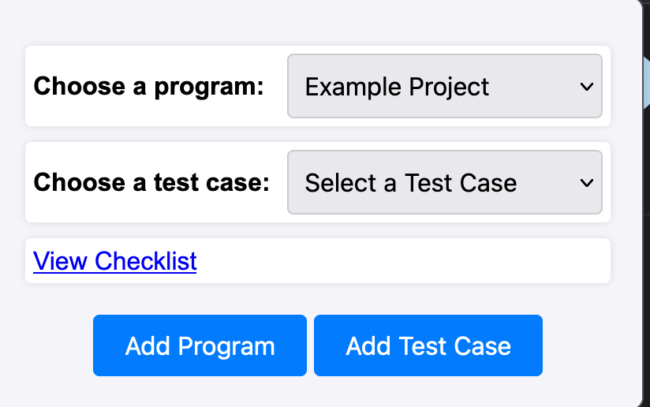
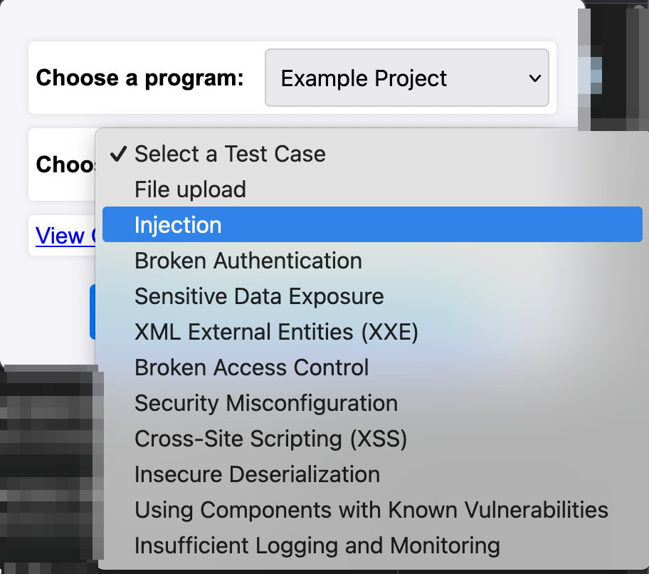
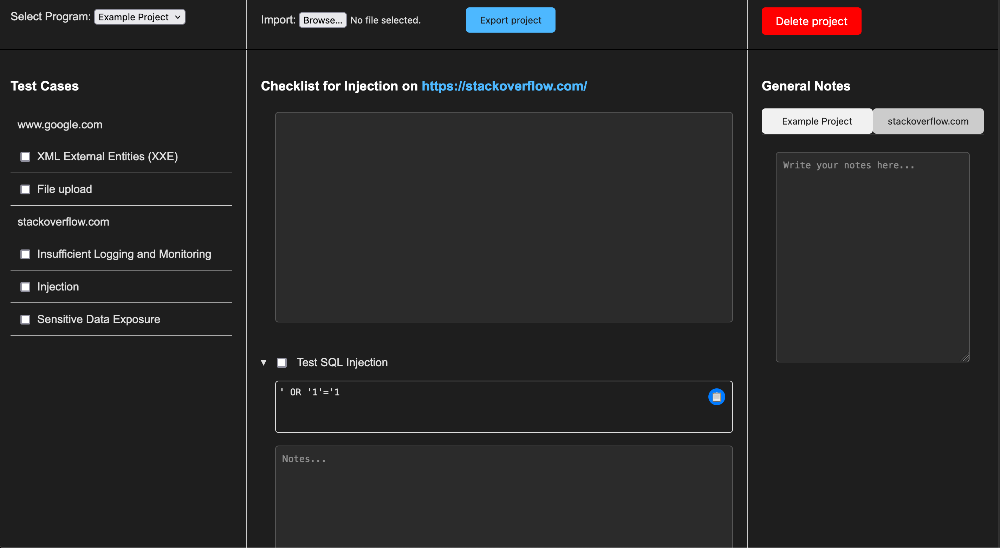

# dpcgen
Dynamic pentest checklist generator

## Installation as unsigned extension
1. Install Firefox developer edition
2. In `about:config` set `xpinstall.signatures.required` to false
3. Pack the extension with `cd firefox; zip -r dpcgen.xpi *` or download the `dpcgen.xpi` from releases
4. Go to `about:addons` and open the cog-wheel drop down at the top. Select `Install Add-on From File` and select the `.xpi`

## Installation as temporary extension (works in non-developer edition)
1. In Firefox go to `about:debugging#/runtime/this-firefox` and select `Load Temporary Add-on`
2. Select the `manifest.json`. The plugin is temporarily installed

> :warning: **Note**: The temporary extension does not retain any progress across restarts and must be installed on each restart of Firefox.

## Adding Testcases
* Test cases can be written in JSON format and added via the extension settings
* See the `testcases` directory for examples
* Test cases must have a title, and at least one task. Each task must have a title and can optionally have instructions (e.g. commands).

## Usage
The user interface allows to create new programs/projects, for which test cases can then be created.

When adding a test case, the current domain is automatically associated with that test case.

The checklist collects all test cases and provides instructions. It is possible to take notes on each test case or sub task and mark them as completed.

In the settings, new test cases can be added as json format.
